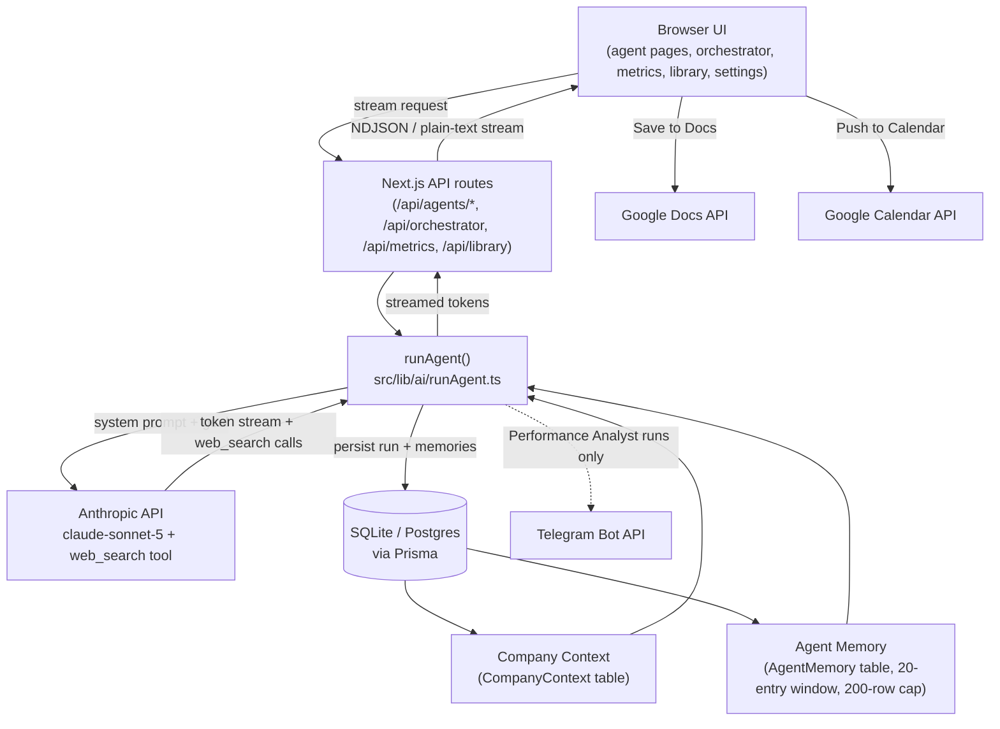

# Kalo AI Marketing OS

A multi-agent marketing operations platform. Seven specialist AI agents — each with its own
personality, system prompt, persistent memory, and dedicated workspace — can be run individually or
orchestrated together toward a single business goal. Every agent is grounded in a shared company
knowledge base, can search the live web, streams its output token-by-token, learns from every run,
and can push its results to Google Docs, Google Calendar, and Telegram.

## Pluggable company context

The architecture originated from an internal marketing system built for a real pre-launch mobile
app. The company knowledge layer that grounds every agent is **data, not code**: it lives in a
single database row, edited through Settings, not hardcoded into any prompt. Swapping it re-points
the entire seven-agent team at a different product — different pricing, different audience,
different competitors — without touching a single file.

That's not a hedge for the public repo; it's the actual design. The seven agent prompts read
product facts (pricing, hero feature, target segments, competitive landscape) from the context
block injected ahead of them, never from literals baked into the prompt text.

This repo ships with a complete fictional demo company — **Verda**, a plant care and identification
subscription app for Southeast Asia — so a fresh clone runs end to end with no setup beyond an API
key. Paste your own context into Settings → Company Context and the whole team retargets instantly.

## Screenshots

_Add real captures here before sharing the repo further — the layout below is the placeholder set._

| | |
|---|---|
|  |  |
|  |  |

## Architecture



Every entry point — an individual agent page, the orchestrator, and the campaign metrics dashboard
— calls the same `runAgent()` function. The logic that composes the system prompt, streams tokens,
persists the run, and extracts memories exists in exactly one place.

## Features

- **Seven specialist agents** — Competitor Intelligence, Creative Angle, Ad Script Generator, Paid
  Acquisition, Performance Analyst, ASO Optimization, Content & Social — each with a distinct
  system prompt, accent colour, and independent run history.
- **Orchestrator** — runs a selected subset of agents sequentially, each one seeing every prior
  agent's output, then synthesises a founder-facing executive summary.
- **Persistent per-agent memory** — every run appends durable learnings that future runs on the
  same agent load back in, capped so it never grows unbounded.
- **Live web search** — agents search the web mid-run; the query appears as an inline pill in the
  stream, not just a citation after the fact.
- **Campaign metrics dashboard** — log weekly numbers, auto-compute CPI, and get an instant
  Performance Analyst read streamed into the page.
- **Output library** — every run across every agent, filterable by agent, date range, and
  free-text search.
- **Google Docs export** — any agent's output becomes a formatted Google Doc (real headings, real
  bold text) in one click.
- **Google Calendar push** — the Content & Social agent's content calendar table parses into real
  calendar events on a dedicated calendar.
- **Telegram notifications** — Performance Analyst runs and calendar pushes notify a chat with a
  structured, phone-readable summary.
- **Swappable company context** — the entire knowledge layer is one database row, editable in
  Settings.

## Tech stack

| Layer | Choice | Why |
|---|---|---|
| Framework | Next.js 14 (App Router) | Server Components for data-loaded pages, streaming Route Handlers for agent runs — one framework covers both without a separate API server. |
| Language | TypeScript, strict mode | Every API boundary (Prisma rows, stream events, form state) is typed; `strict: true` catches the gaps. |
| Styling | Tailwind CSS | Design tokens as CSS variables swapped by a `.dark` class, so light/dark never needs a `dark:` variant on every single class. |
| Database | Prisma ORM + SQLite | SQLite for zero-setup local dev; the schema is deliberately Postgres-compatible (no SQLite-only types) for a one-line datasource swap in production. |
| AI | Anthropic SDK (`@anthropic-ai/sdk`) | Native streaming, the `web_search` server tool, and typed SDK exceptions for retry/error handling. |
| Markdown | `react-markdown` + `remark-gfm` | Agent output is markdown with tables (metric snapshots, keyword tiers) — GFM is required for those to render. |
| Icons | `lucide-react` | Consistent line-icon set; no emoji in UI chrome (agent identity icons are the one deliberate exception). |
| Dates | `date-fns` | Relative timestamps in history panels, date arithmetic in the content-calendar parser. |
| Google APIs | `googleapis` | Official client for Docs, Calendar, and the OAuth2 flow. |

## Getting started

```bash
git clone <this-repo>
cd marketing-os
npm install
cp .env.example .env.local     # then fill in ANTHROPIC_API_KEY and AUTH_PASSWORD
npx prisma db push
npm run db:seed
npm run dev
```

Open http://localhost:3000 and sign in with `AUTH_PASSWORD`. The database seeds with the Verda
demo company context automatically — no further setup needed to see every agent produce grounded,
on-brand output.

Only `ANTHROPIC_API_KEY` and `AUTH_PASSWORD` are required. Telegram and Google are optional — the
app runs fully without them; Settings shows each as "Not configured" until you add the relevant
environment variables.

## How the memory system works

Every agent has its own memory: a running log of durable learnings — facts, patterns, decisions —
that future runs of that same agent load back in. It's how "Cal AI dropped their price to $6.99 in
March" said once stays known without re-discovering it every run.

1. Before a run, the 20 most recent `AgentMemory` rows for that agent are loaded and numbered into
   the system prompt under a `## LOADED MEMORIES` heading.
2. The agent's own system prompt instructs it to close its response with a `## MEMORY_UPDATE`
   section — 2–4 bullet points of what's worth remembering from this run, told explicitly not to
   repeat anything already in the loaded set.
3. Once the response finishes streaming, `runAgent()` splits the raw text on that heading:
   everything before it is the clean output shown to the user and saved as the run; everything
   after is parsed into individual memory rows (list markers stripped, anything under 10
   characters discarded as noise) and inserted, linked to the run that produced them.
4. If an agent's memory count exceeds 200 rows, the oldest are deleted back down to the cap —
   logged when it happens. Memory grows roughly 4–5 entries per run, so this matters within a
   couple hundred runs, not thousands.

Memories are strictly per-agent — nothing agent A learns leaks into agent B's context.

## How orchestration works

The orchestrator runs a chosen subset of the seven agents toward one goal, in a fixed order
(`orchestratorOrder` on each agent), not in parallel — sequential matters, because later agents are
meant to build on what earlier ones found.

1. An `OrchestratorRun` row is created with status `running`.
2. Each selected agent runs in order through the same `runAgent()` every other entry point uses.
   From the second agent onward, its goal is prefixed with a context block containing every prior
   agent's output (truncated to ~1,500 characters each) under a `## CONTEXT FROM EARLIER AGENTS IN
   THIS RUN` heading, followed by the original goal under `## YOUR TASK`.
3. Each agent's run is persisted as a normal `AgentRun` with `orchestratorId` set — so it shows up
   both in the orchestrator's results and in that agent's own history and memory, exactly like a
   standalone run.
4. One agent failing doesn't abort the run; the rest still execute, and the failure is folded into
   the final summary's context. The run only ends in an `error` state if every agent fails.
5. Once every agent has finished, a final synthesis call — not itself a registry agent, but still
   grounded in the company context — produces a founder-facing executive summary: the headline
   takeaway, decisions that need a human, a ranked top-5 action list, and risks to watch.
6. Progress streams to the client throughout as newline-delimited JSON events (`agent_running`,
   `agent_delta`, `agent_done`, `summary_delta`, …), so the UI shows each agent's status dot move
   from queued → running → done in real time, with its output filling in live.

## Project structure

```
src/
├── app/
│   ├── layout.tsx                  # Root layout, theme script, ToastProvider
│   ├── login/                      # Standalone login page
│   ├── (dashboard)/                # Everything behind the sidebar
│   │   ├── layout.tsx              # Sidebar + content column
│   │   ├── page.tsx                # Orchestrator (home)
│   │   ├── agents/[agentId]/       # Dynamic agent workspace, one template for all seven
│   │   ├── metrics/                # Campaign metrics dashboard
│   │   ├── library/                # Cross-agent output library
│   │   ├── settings/               # Company context editor + integration status
│   │   ├── error.tsx               # Route-level error boundary
│   │   └── loading.tsx             # Route-level loading fallback
│   └── api/                        # Route handlers — agents, orchestrator, metrics, library,
│                                    # google/*, auth/*, company-context, settings/status
├── components/
│   ├── layout/                     # Sidebar, ThemeToggle, LogoutButton
│   ├── agents/                     # Agent workspace UI
│   ├── orchestrator/               # Orchestrator UI
│   ├── metrics/                    # Metrics dashboard UI
│   ├── library/                    # Output library UI
│   ├── settings/                   # Settings page UI
│   └── shared/                     # MarkdownRenderer, Toast, SaveToDocsButton,
│                                    # PushToCalendarButton, EmptyState
├── lib/
│   ├── agents/                     # Registry + all seven system prompts
│   ├── ai/                         # runAgent, runOrchestrator, memory, Anthropic client
│   ├── integrations/               # Telegram, Google OAuth/Docs/Calendar, status
│   ├── contexts/demo.ts            # The Verda demo company context
│   ├── companyContext.ts           # DB-backed context loader with a demo-context fallback
│   ├── auth.ts, db.ts, utils.ts, metrics.ts
├── middleware.ts                   # Auth gate
└── types/index.ts                  # Shared cross-cutting types
prisma/
├── schema.prisma
└── seed.ts                         # Seeds the Verda demo context on first run
```

## Roadmap

- **Meta Ads API integration** — pull real campaign performance directly instead of manual entry
  in the metrics dashboard.
- **An AI Guard sub-agent** — per-ad kill/keep/observe decisions made automatically against the
  same benchmarks Performance Analyst already reasons over.
- **A decision journal** — a durable log of which agent recommendations were acted on, and what
  happened, closing the loop that memory alone doesn't.
- **Multi-user auth** — per-user accounts and permissions in place of the single shared password.
